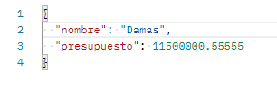
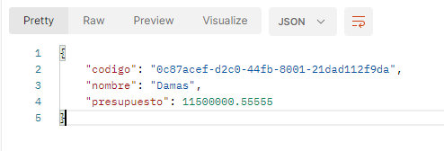

# Prueba técnica Cobrando BPO


## Se desarrolló una pequeña app que crea y asigna empleados a departamentos determinados

- Utilizando un entorno node.js
- Express para levantar un pequeño servidor 
- Sequelize como ORM para interactuar con una base de datos relacional tipo postgreSQL

## Como punto de entrada en la aplicación para ser probada de manera local

- Se debe ejecutar el comando: **npm intall** o **npm i** dentro de la carpeta `./api` para hacer instalaciones de dependencia
- Se deben remplazar las variables de entorno en el archivo `.env` por las credenciales a usar en la base de datos local 
```
PGDATABASE=nombreBaseDeDato
PGHOST=localhost
PGPASSWORD=passwordDePostgres
PGPORT=puerto
PGUSER=usuariodepostgres

```
-Levantar el servidor ejecutando el comando ***npm start***

## Desde una aplicación que realicen peticiones http podemos comprobar su funcionamiento

### Las pruebas se realizaron con postman pero podría funcionar con cualquier aplicación de este tipo

#### Las rutas que realizan un CRUD de un departamento:


  - **post('/departamentos')**: Para crear un departamento.

  - **get('/departamentos')**: obtenemos todos los departamentos.

  - **get('/departamentos/:codigo')**: obtenemos un departamento en particular, que coincida con el código del departamento.

   - **get('/departamentos/:código/empleados')**: obtenemos todos los empleados que pertenecen a un departamento. 


   - **put('/departamentos/:código')**: para actualizar un departamento.

  - **delete('/departamentos/:código')**: para eliminar un departamento.

#### Las rutas que realizan un CRUD de un empleado:

- **post('/empleado')**: Para crear un empleado.

  - **get('/empleados')**: obtenemos todos los empleados.

  - **get('/empleados/:código')**: obtenemos un empleado en particular, que coincida con el código del empleado pasado por la url.

   - **put('/empleados/:codigo')**: para actualizar un empleado, que coincida con el código del empleado pasado por la url.

  - **delete('/empleados/:código')**: para eliminar un empleado, que coincida con el código del empleado pasado por la url.

  __IMPORTANTE__: La aplicación escucha en el puerto 1234, las peticiones se deben hacer en la url local  `http://localHost:1234/` seguido de la ruta que se desea consultar.

  ### Consideraciones para crear un departamento 

  - Para crear un departamento debemos enviar un objeto JSON con las propiedades, nombre y presupuesto como se muestra en la imagen 

<p align="left">
  
</p>

  - Y obtendremos una respuesta donde se indica que el departamento fue creado y veremos que responde un objeto JSON, con una propiedad adicional que es el código del Departamento  
  <p align="left">
  
</p>
